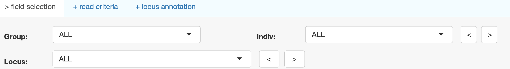
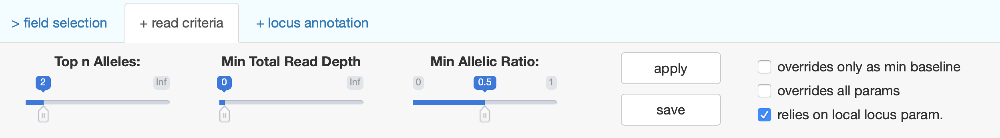
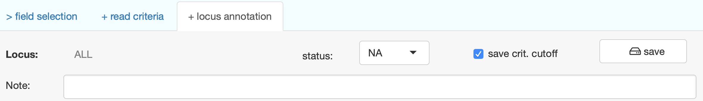

`microhaplot` comes pre-loaded with two small, real, example data sets, 
`fish1.rds` and `fish2.rds`, to get you started learning about its 
functionality.
This vignette will walk you through the process of viewing these example data 
sets and will introduce you to many of the features of `microhaplot`.
Each data set consists of microhaplotypes derived from
amplicon sequencing of a marine species, and they represent subsets of
data that have been previously employed in full analyses.

The data that we will be exploring will be available
after installation of the R package and the Shiny app. Once the R package
`microhaplot` is installed, the Shiny app can be installed like this:
```r
# provide a directory path to host the microhaplot Shiny app
shiny_dir <- tempdir()
microhaplot::mvShinyHaplot(shiny_dir)
``` 
where `tempdir()` should be replaced by a location on your hard drive where 
you want the Shiny app installed. 

Once it is installed, the Shiny app is run like this:
```r
app.path <- file.path(shiny_dir, "microhaplot")
microhaplot::runShinyHaplot(app.path)
```

# About the example data
The data set in `fish1.rds` contains microhaplotypes from 22 amplicons in 436 
individuals of one population group. `fish2.rds` consists of data from 14
amplicons in 288 individuals from two populations. The actual sequencing runs 
that produced the data contained many more loci, but we have subsampled the
original data sets in order to make the data portable. The motivation behind
supplying two datasets is to show that, despite both being derived from 
amplicon-sequencing reads, there is great variation in read depth between the
two data sets, and this will affect the reliability of called genotypes.  

# Microhaplot layout

The `microhaplot` shiny viewer is split into three horizontal "panels". From top to bottom, they are:

## **Interaction tabset** (top)  
These are the three tabs that live at the top of the page with the light
blue background.  Any one of the three: ">&nbsp;field selection", "+&nbsp;read criteria", and "+&nbsp;locus annotation"
can be selected.  Whichever one is selected determines the content of the panel directly beneath---the
user input panel, the panel with the light gray background.  

  a. **Field selection tab:**<br>  
    
    <br><br> 
    If the "> field selection" is selected, then the user input panel will include
    dropdown boxes that let you choose a group, locus, or individual(s) that you wish
    to focus on (this choice affects what is shown in different plots and outputs,
    etc.)<br><br>
    The top choice in each dropdown box is "ALL" which indicates that results
    for all (groups, individuals, or loci) are to be portrayed at once. This tab also
    includes "backwards-and-forwards" buttons, "<" and ">", that sit
    immediately to the right of the **Indiv** and the **Locus** dropdown boxes,
    and which allow you to step backward or forward through the content
    of the dropdown boxes. These "backwards-and-forwards" buttons are very
    useful when you want to work your way through each locus, one at a time,
    to choose those that do (and do not) appear to be reliable enough to
    include in a panel of amplicons. (*Note:* the location and relative position
    of each button might change, depending on the width of the viewing window.)
  
  b. **Read criteria tab:** <br>  
        
      <br>
    In the "+ read criteria" tab, you are given the choice to define the top $n$ alleles, minimum read depth and minimum allelic ratio.  These values specify a series of filters that microhaplotypes must satisfy to pass through the analysis. It is recommend to adjust these filters in a particular order, as follows:
    
      i. `Top n Alleles` defines the maximum number of distinct microhaplotype sequences
        (in a single individual's locus) to be kept, starting from the highest-read-depth haplotype and proceeding to haplotypes found in lower read depths. Ideally, the top n alleles should match the ploidy
        of the species you study. So for a diploid organism, the *top n alleles* should be set to 2. For a
        tetraploid, the *top n alleles* should be set to 4.
    
      ii. `Min Total Read Depth` or _Minimum Total Read Depth_ defines the
        minimal total number of reads from the "Top n alleles" required for a locus to pass filter within
        an individual.  It can only take values greater than or equal to 0.   
        <br>For example, if `Top n Alleles` is set to 2, and `Min Total Read Depth` is set to 15, then if Individual A's two highest read depth haplotypes at Locus 1 are CCA with 10 reads and GGA with 7 reads, then the two haplotypes retained from Individual A at Locus 1 are CCA and GGA.  
        <br>By contrast, if Individual B's two highest-read-depth haplotypes at Locus 1 are GTC with 6 reads and GGA with 5 reads, then, because the total number of reads of those two haplotypes is 11, which is less then 15, none of Individual B's haplotypes at Locus 1 will pass this criterion, and, therefore, no genotype will be reported for Individual at Locus 1.
        
      iii. `Min Allelic Ratio` or _Minimum Allelic Ratio_ defines the minimum allelic ratio that a haplotype needs to pass filter. It must be between 0 and 1. 
        For a particular locus, L, of individual I, the allelic ratio of haplotype/allele X is defined as the ratio of the observed read depth of haplotype/allele X at L in I to the read depth of the haplotype/allele with highest read depth at L in I.  
        <br>The `Min Allelic Ratio` filter removes from consideration those reads of an allele/haplotype that occur in low depth relative to the highest-read-depth allele.
        It is important to understand that the _allelic ratio_ is a quantity that applies to each distinct haplotype (allele) at a locus within an individual, and it is relative to the haplotype/allele with the highest read depth.
        Accordingly, the values of allelic ratios you should expect to see in an individual that is truly homozygous or heterozygous are as follows:
        
        > In a **homozygous** individual, the highest read depth allele should be the one carried in n copies by the n-ploidy individual.  Therefore you expect that true allele/haplotype to have a large read depth and an allelic ratio of one while other alleles/haplotypes should have low allele-specific read depth and allelic ratio close to zero.  
        
        > In a truly **heterozygous** diploid, the two alleles/haplotypes carried by the individual will, ideally, each have a large and similar number of reads, which means that their allelic ratios should be at or near one. 
        
        Once you set up these three criteria, you  _apply_ them to see their effects on the
        currently displayed data visualization with the _apply_ button. You can also _save_
        these criteria if you want the values to "stick", by clicking the "save" button. 
        
        iv. _Additional options for applying and saving_:  When  `ALL` is chosen from the dropdown box in the ">&nbsp;field selection" tab,
        additional filtering options 
        will be available at the right hand side of the "+&nbsp;read criteria" tab. Details for each
        of the options are displayed if you hover your pointer over it:
            * `overrides only as min baseline`: when selected and _apply_ or _save_ is chosen, the selected values for all
            three of the aforementioned criteria (`Top n Alleles`, `Min Total Read Depth`, and `Min Allelic Ratio`)
            will replace the current values of the criteria for every locus in which the saved value is greater than 
            the currently selected values.  This is useful when you want to set
            a minimal baseline for every single locus. For example, if minimal total read depth for loci A and B are set
            set to 5 and 11, respectively, and the value for `ALL` has been set to 10, then the minimal total read
            depth for locus A will be updated to 10 when this
            option is selected and _apply_ or _save_ is chosen.
            * `overrides all params`: This option, when selected and _apply_ of _save_ is chosen,
            will set `Top n Alleles`, `Min Total Read Depth`, and `Min Allelic Ratio`, to be whatever the currently
            selected values are. Be wary that there's no way to undo this 
            process once this option is selected and applied. For example, if minimal total read depth for locus A, B,
            is set to 5 and 11, and the value for `ALL` has been set to 10, then the minimal total read depth for locus A and B will both
            be updated to 10 when this option is selected and _apply_ or _save_ is chosen.
            * `relies on local locus param.`: It is very helfpul to select `ALL` loci for viewing in broad summaries
            such as those in the _Summary->Global Scope_ panel described below.  When choosing these views,
            one might want to preserve each locus's specific filtering criteria (as saved using the steps above) rather
            than the criteria applied to `ALL` loci.  In order to effect this, the `relies on local locus param.` box should
            be checked and, after that, the _apply_ button should be activated (it is important to hit the _apply_ button 
            every time you switch back to `ALL` loci.
            
        Understanding how these options work can take a little practice.  We recommend that the user spend some time playing
        around with the various options while viewing the effects on the "locus annotation" output of the Table panel (see the Table
        section under the Panel Choice Tabset section below.)
      
  c. **Locus annotation tab:**<br>
    <br>
      
    <br>
    This tab is for users to keep track of whether a certain locus should be retained based
    on its quality or other attributes. This is most useful when a particular locus has
    been chosen under the "> field selection" panel. There is also a small textbox that
    lets you insert any comments you would like to record about a particular locus.
    You must press the **save button**
    to submit this information about each locus. All of this locus-annotation information
    can be retrieved under the table selection for "locus annotation" under the `Table` tab (see below).


> **Ways to access saved criteria values and locus annotations in file format:** All of the saved parameters such as `Min Total Read Depth`, as well as the locus annotations, are stored in a data frame in memory and are read in and saved as serialized R objects in an RDS file in the same directory path as the shiny app. The name of this file has the suffix `_annotate.rds`. For example, for `fish1.rds` data, the file name is `fish1_annotate.rds`.  That file can be used to retrieve the data.  A better way to retrieve the data is by downloading the "locus annotation" table from the `Table` tab at the bottom pane. For the courageous, you can set the filters and annotations elsewhere, save those into an RDS file named appropriately (with the `_annotate.rds` suffix) and then insert that file into your microhaplot analysis by copying it to the directory path where the shiny app resides.  This is not recommended for the faint of heart, as bungling the format of the data frame (or the exact locus names) in that RDS file could have unforeseen, unexpected, or even catastrophic consequences...

## **Main body panel** (center)
This panel occupies most of microhaplot's screen real estate.  It is where the actual
plots, tables, and other results are rendered.  What gets shown here depends on which main body panel
has been chosen - located right at the bottom.  That choice is made using the *main panel choice tabset* described below.

## **Panel choice tabset** (bottom)
This tabset is always down at the bottom of the screen, and the choices on this tabset allow you to choose the contents to be displayed in the main body panel.
It looks like this:  
<br>

<br>
<br>
In the following, we will describe all these different main panels, but, since they are rather large, we
will not include any pictures of those panels.  It is recommended that the reader follow along
with this vignette using the example
data in microhaplot.  That will help a lot.

  a. *Data Set:*  provides a dropdown box in the main panel that you use to choose which data set you want to explore.
    The choices in the dropdown box are taken from the `.rds` files that are in the `app.path` 
    directory described above.
    When you start microhaplot after a clean install, the default dropdown choice is `fish1.rds`, and the
    other possible choice is `fish2.rds`.      
  b. *Summary Info: * displays a condensed graphical summary of the characteristics of microhaplotype reads by groups, individuals, or loci.  These are particularly useful for overviews when the "ALL" choice is given for individuals and loci in the "> field selection" tab.     
  c. *Criteria Cutoff: * contains:   
      i. `Global Scope`: This section displays summaries of the distributions of read depths and allelic balance ratios to assist the user in
      setting appropriate values for those filter cutoffs. Histograms of read depths and allelic balance ratios are presented for
      only one locus, or combined across `ALL` loci, depending on the settings in the "> field selection" tab.
      If only a single locus is selected, the histogram of read depths and allelic balance ratios are shown for each allele, as well. 
      Looking at the distribution of allele-specific read depths can be very useful for identifying alleles that are
      linked to variation that interferes with PCR of the amplicon.
      At the bottom, beneath the graphical histograms,  we also provide a tabular summary of the number of alleles and the number of individuals
      with callable genotypes (given the filters) available at different cutoffs for the minimum total read depth and the minimum allelic ratio.   
      ii. `Quality Profiling`: This segment displays individuals or loci that may carry more alleles with high read depth than
      expected, possibly indicating that the sample is contaminated, or that the amplicon targets paralogous or repetitive loci.
      To highlight those problematic loci or individuals, a _per-allele_ minimum read depth filter is used, rather than a
      minimum _total_ read depth filter.  This per-allele read depth is set using the `Min read depth (per haplotype)` slider input
      at the top part of the main panel.
      The upper plot graphically summarizes the individuals or loci that might 
      have more high-read-depth alleles than expected. The individual list shows a point at 
      0, 1, 2, ..., where each of those values gives the number of alleles above the "Top n" filter criterion that have
      read depths that pass the allele-specific read depth filter.  Having a large point at 0 is good.  Points at values greater than
      0 record the number of individuals with that many loci having extraneous alleles of high read depth. The "Loci List" provides 
      an analogous summary for loci.  The details of all these items can be further examined in the bottom table.  The Search box
      at the upper right of the table is 
      particularly useful for tracking down a specific individual sample or locus in the table output.
  d. *Genotype Call: * offers a more intimate look and analysis of how genotypes are being called at a single locus, and of the allele specific read-depths
  within those genotypes.    
      i. `AR refinement`: This panel displays a scatterplot that shows the relationship between the 
      allele with the highest read depth and the allele with the second-highest read depth.  It is 
      most suited to handling data from diploid organisms. This space also provides you the
      tools (found on the left) to fine-tune allelic ratio parameters (such as defining the maximum
      allelic ratio for homozygous genotype calls and the minimum allelic ratio for heterozygous genotype calls)
      so that individuals with questionable allelic balance ratio will not receive called genotypes.   
      <br> 
      The lines on the plot are as follows:
          * <span style="color:purple">Solid Purple Line</span>: This shows the consequence of the `Min Total Read Depth'
          filter.  It is slanted down and right because it is a criterion on the sum of the read depths of the
          two highest-read-depth alleles.  Points that fall below and to the left of this line appear as
          X's because they are no-calls.
          * <span style="color:orange">Dashed Orange Line</span>: This line shows where the standard `Min Allelic Ratio`
          filter resides.  It shows that any point below that line will, by default, be considered a heterozygote
          because the allele with second-highest read depth has an allele balance ratio that is high enough (i.e. its
          read depth is close enough to that of the highest read depth allele that it is believed to be a true allele.)
          * <span style="background-color:yellow">Solid Yellow Line</span>: This line shows the Min Allelic Ratio for 
          Heterozygotes cutoff associated with the `Min AR for Het (yellow)` slider input to the left side of
          the panel.  In the beginning of an analysis, it will be set the same as the dashed orange line, but
          can be tailored for specific loci.  For example, some loci might have most heterozygous individuals with
          an allelic ratio near 1, but a few of them have allelic ratio near 0.6. To exclude those individuals 
          with low-ish allelic ratio, you could set the `Min AR for Het (yellow)` to 0.7, which will move the
          yellow line down, and will consider the aberrant heterozygous individuals as no-calls.
          * <span style="color:aqua">Solid Aqua Line</span>: This shows the Max Allelic Ratio for Homozygotes
          cutoff associated with the `Max AR for Homoz` slider input.  Changing this allows you to filter out
          those individuals that are considered to be homozygotes, but those whose second-highest-read-depth
          allele is concerningly high.   
          
          <br>
          In order to save the Min/Max AR values chosen for heterozygotes or homozygotes, you can choose _save_ from the 
          "+ read criteria" tab.   
          <br>
          Below the scatterplot, you will also find the distribution of read depths and the allelic depth ratios
          of different haplotype-alleles in relation to whether each alleles was included in a genotype call
          and whether or not that genotype call was considered homozygous or heterozygous.
      ii. `Summaries` shows haplotype frequencies within each group, and a visual interactive summary
      of conformance to Hardy-Weinberg proportions of individual loci, and also portrays the position
      of these variants within the sequence.

  e. *Table: * This panel provides a place to get a number of tabular views (available in the "Select Table:" dropdown box) of the data that are sortable and searchable. 
  The output of each is self-explanatory with a little exploration. This can be very useful when you want to dig into the fine details of the short read data.
  It also allows you to download filtered and called data and genotypes for later analysis. Note that clicking a column name will sort on that column (purple triangle pointing
  up or down depending on sort order, which can be changed be clicking it again).  To sort on multiple columns, you can shift-click them.  The rows can be filtered by 
  those rows matching a certain string but putting that string in the Search box.  For this to be most useful it is recommended that all sample and locus names not 
  be simply numeric (i.e. call it `Loc_110`, instead of `110`, and `Fish_36`, instead of simply `36`). Note that the `fish1.rds` data set does not adhere to that convention
  for sample names.
  
  f. *About (microhaplot): * provides a little background about microhaplot and how to cite it and whom to contact about it.

With that background we are ready to start exploring the example data.

# Mission one: An overview of loci

The first thing we are going to do is get an overview of the data with no filtering, focusing on
different loci.  To do this, we choose *Summary Info --> By Locus*.  We also want to
make sure that we are starting from the defaults in ">field selection" (ALL group, ALL loci, ALL individuals),
and under "+read criteria" you want to ensure that "Minimal Read Depth" and "Minimal Allelic Ratio" are
both set to 0.  (If you had changed these before, then, once you set them back to 0, you should hit the "apply"
button to apply the changes.)

Choosing *Summary Info --> By Locus* will give you four plots.  By default, only the first 15 loci are
represented (the reason for this is that if you have many loci, you don't want to end up waiting for an
eternity to have the final plots rendered.)  You can change the number of loci shown using the
"Display" dropdown menu that lives just beneath the user input panel.  You can also choose to go through
the loci, 15 at a time by choosing which page to go to using the "Page" selector to the right of the
"Display" selector.  

The four figures shown in this `By Locus summary` are, from left to right:

1. The distribution of the number of haplotypes observed per individual.  Recall that these are subject to the current filters, of which there are none, so each haplotype, even if it is only observed at a read depth of
1 read in an individual is counted as observed.  This plot is a bubble plot that essentially is giving
histogram-like information.  The y-axis has different locus on each line.  The x-axis is the number of unique haplotypes
and the size and shading of the bubbles indicate how many individuals in the data set had the given
number of unique haplotypes.    It is particularly revealing to focus on locus `tag_id_1166` (fifth locus in main body panel).  Most individuals
have a large number of different haplotypes, likely occurring at very low read depths.  At any rate, this
plot makes it clear that there are a lot of low-read-depth sequences that are superfluous and incorrect.

1. Moving to the right is another figure that has loci arranged on the y-axis and number of haplotypes on the
x-axis.  However, in this case, the number is counting the total number of unique haplotypes observed at the
locus when only the two highest-read-depth haplotypes are recorded per individual.

1. The third plot is a plot with light blue points indicating the fraction of individuals that have
sufficient read depth to allow a genotypes to be called given the current settings of the read depth and allelic ratio filters.  
Obviously since there is filtering, every locus is going to have a genotype called at every individual.

1. The final plot (the furthest right) just shows violin plots expressing the distribution of read depths at
each locus across the individuals.  Notice that the x-axis is on a log scale.  The plus denotes the median read
depth.  

Now that we know what all of these plots mean, we can interpret what we see.  

We note that most loci have a
read depth greater than 20 at all the individuals.  Also there is a huge amount of
variation across loci in the number of recorded haplotypes per individual.  Since any
diploid individual will have at most two distinct haplotypes at a locus, most of these haplotypes
are spurious, and we can hope that most of them are at very low read depths and will be filtered out.
We will investigate that now.

## Let's apply some filters

Here is the moment we have all been waiting for.  We have been looking at our data in a totally unfiltered state---effectively regarding
a haplotype with 1 read to be on an equal footing with one having, say, 1000 reads in an individual.  There are two, simple, main
filtering methods in microhaplot.  The first is to discard haplotypes from individuals if they occur in fewer than a certain number
of reads (The "Minimal Read Depth" criterion).  The second is to discard haplotypes from individuals if their read depth is less than a given fraction of the haplotype
with the highest read depth at the locus in the individual (The "Minimal Allelic Ratio" criterion).  Choose 25 for the Minimal Read Depth and
slide the bar to 0.2 for the Minimal Allele Ratio, and then hit "Apply".  

Once those filters take effect we find that most individuals are observed to carry one or two haplotypes at each locus.  Some loci
have more haplotypes that that observed in some individuals.  We will want to check up on those later.  Some of the loci clearly did
not sequence well.  For example `tag_id_1511`.  (hint: look for violin plot w/ skewed far left distribution) To see an expanded view of a few loci, you can highlight (with a click drag) their
rows in the left hand figure and then double click those to get a zoomed in view.  To zoom back out, to be able to see all
the loci, just double click the body of the left figure.  

# Mission Two: An overview of individuals

We can take those same filters we just applied and get a good overview of our sequencing data on an
individual basis.  Go ahead of choose *Summary Info-->By Individual*.  from the main panel choice
tabset on the bottom of the screen.  The initial screen that comes up includes only 15 of the individuals.  We can change that
by choosing "ALL" in the "Display (indiv/pg) " dropdown.

This "By Individuals" summary view of the data provides four different plots.  From left to right they
are:

1.  The ratio of the haplotype with 2nd highest read depth to the haplotype with highest read depth.  
In this plot, the y-axis denotes individuals, the x-axis represents the ratio (it goes from 0 to 1)
and each locus is represented as a bubble.  The size of the bubble is scaled to some function of
read depth, but it is hard to place that on an absolute scale.  The main take home message
from this plot is that for most individuals at most loci the two highest-read depth haplotypes have
fairly similar read depths.  For example a ratio of 0.75 indicates that if the haplotype with highest
read depth at a locus in an individual was 100 reads, then, the haplotype with second highest read
depth was 75 reads.  

1. The number of haplotypes observed in each individual.  This is a bubble plot that expresses the relative
number of loci at which 1, 2, 3, etc haplotypes were observed after filtering.  

1. The number of loci within the individual with sufficient read depth to call a genotype (given the current read depth and allelic ratio filters).

1. The distribution of read depths at all the haplotypes that were not filtered out at all the loci in the individual.
These are portrayed as violin plots with individual
values as dots within them.


It should be noted that the colors of the bubbles on the left-most graph indicate the different
groups that the individuals fall into.  This is particularly useful when individuals from different
populations or species are in your dataset.  In the case of our example data, we have merely
assigned half of the individuals to be from "pop1" and the other half from "pop2".

## Spotting some dodgy individuals

This overview of all the individuals gives us a good chance to spot a few problem fish
right off the bat.  Just scanning down the fraction of loci that the individuals might be
called at, it is clear that s45 and s277 had limited sequencing success.  That is clear by
looking at the distribution of read depths across loci.  Perhaps even more intriguing is
individual s288 that seems to have pretty reasonable read depths, but very poor allelic
balance.  

## Looking at the raw counts for s288

Another way to look at the data is through the tabular format.  If we want to see tabular data for individual s288, choose "Table" from the main panel choice tabset.   By
default this will show a few lines of the "Observed variants (unfiltered)" table.
You can change which table is viewed using the "Select Table" dropdown, but unfiltered
observed variants is great for now.  

In the search box on the right, enter `s288` and hit return. Note: search box is not case sensitive.  This will filter the table to only those rows that include s288.  Once that is done, click on the "locus" column heading to
sort entries by locus.  Voila! Now you can peruse all the observed variants and their read
depths at this individual s288.  Where it says "Show 15 entries" on the left hand side just above the table you should change the "15"
to "All".  This will give you a single scrollable window of all the entries for s288.  Note that
the column "Haplo" gives the sequence of the reads at the variable positions.  These are
essentially the haplotypic states of the reads.

Going through the data for 288, it is clear that there will be some genotypes that are not
straightforward to call.  For example, at locus `tag_id_879` there are three different
haplotypes with read depths over 50:  128 reads of CCCTCTG, 100 reads of CCCTCAG, and
57 of GCCCCTG.  That is clearly going to be difficult to genotype.  Perhaps this
individual has contaminated DNA or represents two individuals that were barcoded equivalently.
It probably should be tossed out of the final data set.

## Raw count data for a less dodgy individual?

So, the data for s288 was a little disquieting, but recall that was an individual that
looked pathological from the very beginning.  So, what if we look at the raw count
data for an individual that doesn't look so dodgy?  This will be a good exercise to
build up some intuition about how genotyping might be done with microhaplotype read
data.

Let's have a closer look at individual s95.  From the overview, this is an individual with
reasonably clean, abundant reads.  We can filter on this individual merely by replacing
"s288" in the search box with "s95".  A cursory glance at the results for this individual
show us what appears to be an individual that will be very easy to genotype:  there are never
more than two haplotypes at high read depth but there is always at least one haplotype
at high read depth.  When two haplotypes are at high read depth, their read depths
are largely quite similar.  

# Looking over different loci

## Summaries

When we are interested in assessing how well each locus behaves in reporting microhaplotypes, it is time to turn to the "Filter Analysis" panel choice.
First, go ahead and choose *Criteria Cutoff --> Global Scope*.  This view gives you histograms of the
read depths and allele balance ratios (the filtering choices in effect appear as dashed red lines), and, below that, a tabular
perspective on the outcome of different filtering choices on the total number of haplotypes
recorded in the data set.  The field selection choices that are present are applied here. So,
if ALL loci are selected, then the histograms include reads from all the haplotypes at all the loci, and the
tabular summary counts up the total number of haplotypes typed and the total
number of individuals typed at all loci.  If you select just one locus, the results reflect that
one locus, and the histogram results are further broken down by different haplotypes within that locus.

With that in mind, choose the first locus in the dropdown menu: `Plate_1_A11_Sat_GE820299_consensus` under "> field selection"
and see how that changes the broad summary.  Note that across a broad range of the two filtering
options (minimum read depth and minimal allelic balance) there are eight haplotypes in total discovered.

In order to search for individuals or loci that have more high-read-depth alleles that one would want, you
can choose *Criteria Cutoff --> Quality Profiling*.  This view shows individuals or loci that have
more than $n$ alleles that pass the filters.  For example, if you are dealing with diploids, then you would
set $n$ to 2 (in the "+read criteria: Top n Alleles" option).  Then any individuals or loci that had more than
2 alleles that satisfied the minimum read depth and allele balance criteria would be noted here. This is good
way to look out for contaminated samples or loci that amplify paralogous regions.


To see how the inferred haplotypes look in terms of haplotype frequencies, and also how the genotypes
look in terms of Hardy-Weinberg equilibrium, you can choose *Genotype Call --> Summaries*.
This view consists of four figures.  The first, in the upper left simply shows the frequencies (and the total read depth) of
different haplotypes.  The plot in the upper right shows the relationship between the
observed frequency of different genotypes and the expected frequencies under Hardy-Weinberg equilibrium.
The individuals used in creating these summaries depends on which "Group" is chosen.  In this case we have
"ALL" chosen, and that is fine because the two groups are essentially identical, genetically.  However,
if we were dealing with groups that were genetically differentiated, we would not want to assess
conformance to Hardy-Weinberg proportions of a mixture of those different groups!  In such a case
it is worthwhile to look at one group at a time.

The expected number of different genotypes is shown by the outlines of circles and the observed number by the
filled, colored circles.  Green are homozygotes, orange are heterozygotes, and it should be relatively
self-explanatory.  There is not a scale, but if you click in the center of any of the genotypes with
observed (non-zero) counts, you will be told (in the upper left of the panel) what the expected and
observed numbers were for that genotype.  These plots are not meant to provide a defensible test
of departures from Hardy-Weinberg equilibrium, but do allow the user to diagnose loci that are
grotesquely far out of Hardy-Weinberg equilibrium.

Below the haplotype frequencies and HW conformance plots you will find a simple bubble plot
expressing haplotype frequencies in the different groups.  In the case of the example data there
are only two different groups and they have very similar allele frequencies.  This plot becomes more
useful when one is comparing allele frequencies across many different groups.

Finally, you may need to scroll down to see the final figure in this display.  It is a representation of the
haplotype sequences, their frequencies, and the positions of the variants within them along each amplicon.

## Allele Biplots

Choosing *Genotype Call --> AR Refinement* takes you to a very informative screen.  It is described above
in the vignette.  Read through the section that describes it and then try playing with the sliders to
move the four different lines around the plot and see the effect on whether genotypes get called or not.

Note that you can use the blue lasso tool (upper right corner of the scatter plot) to select a lot of
points, whose values will then be revealed in a table below.  The red lasso can be used to de-select points
and you can check the box "keeps pt selection between loci" to maintain focus on those points as you
move from locus to locus.  This can be very useful for identifying individuals that show aberrant read depths
across multiple loci.


# Output of data

We have already witnessed how to use the *Table* panel to look at the raw data.  It is also possible to
download filtered, unfiltered, and processed data from this view using the "Download Data" button. This
saves output in CSV files.

# Locus annotation

The program can be used to annotate different loci (and assign filtering criteria to them). This
annotation can be done using the "+locus annotation" interaction tabset, and the results saved
by downloading the locus annotation data from the *Outputs* panel.

### importing external input data
